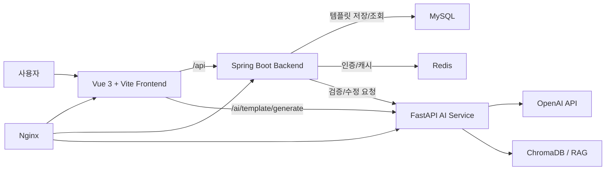

# PLS Jober

AI 기반 카카오 알림톡 템플릿 생성, 수정, 검증 서비스

> 대표 이미지(GIF) 추가 예정  
> 예시 경로: `docs/images/demo.gif`

--------------------------------

## 프로젝트 개요

- 기간: 추후 기입
- 인원: 추후 기입
- 역할: Frontend, Backend, AI Service 연동 및 알림톡 템플릿 생성/검증 플로우 구현

--------------------------------

## 프로젝트 배경

카카오 알림톡은 정해진 정책과 형식을 만족해야 승인될 수 있습니다. 하지만 실제 템플릿 작성 과정에서는 문구 규정, 변수 형식, 광고성 표현, 카테고리 적합성 등을 사람이 반복해서 확인해야 하므로 작성과 검수에 시간이 많이 소요됩니다.

PLS Jober는 사용자가 원하는 메시지를 입력하면 AI가 알림톡 템플릿 초안을 생성하고, 이후 채팅 기반 수정과 정책 검증을 통해 승인 가능한 형태로 다듬을 수 있도록 돕는 서비스입니다.

--------------------------------

## 핵심 기능

### 1. AI 알림톡 템플릿 생성

> 스크린샷 추가 예정: `docs/images/template-create.png`

- 사용자가 원하는 알림 목적과 내용을 입력하면 AI가 카카오 알림톡 형식의 템플릿을 생성합니다.
- 생성 결과에는 템플릿 본문, 제목, 카테고리, 변수 목록이 포함됩니다.
- 생성 직후 백엔드에 1차 저장하여 이후 수정/검증 단계에서 동일한 템플릿을 이어서 관리할 수 있습니다.

### 2. 채팅 기반 템플릿 수정

> 스크린샷 추가 예정: `docs/images/template-modify.png`

- 사용자는 생성된 템플릿을 보면서 채팅으로 수정 요청을 입력할 수 있습니다.
- AI 서버는 기존 템플릿, 제목, 채팅 히스토리를 기반으로 수정본을 반환합니다.
- 수정 버전을 관리하고, 남은 수정 횟수를 세션 기준으로 제한합니다.

### 3. 카카오 알림톡 미리보기

> 스크린샷 추가 예정: `docs/images/kakao-preview.png`

- 생성/수정된 템플릿을 카카오 알림톡 형태로 미리 확인할 수 있습니다.
- 변수 표시 토글을 제공해 실제 발송 전 치환 대상 값을 쉽게 파악할 수 있습니다.
- 문제 영역이 발견되면 미리보기 안에서 하이라이트하여 사용자에게 피드백합니다.

### 4. 템플릿 정책 검증 및 대안 제안

> 스크린샷 추가 예정: `docs/images/template-validation.png`

- 백엔드는 FastAPI AI 서버로 검증 요청을 전달합니다.
- AI 서버는 제약 조건 검증과 의미 기반 검증을 수행하고, 문제 영역과 반려 사유를 반환합니다.
- 프론트엔드는 반려 사이드바에서 오류, 경고, 대체 문구를 보여주고 사용자가 대안을 적용할 수 있게 합니다.

### 5. 인증 및 마이페이지

> 스크린샷 추가 예정: `docs/images/mypage.png`

- 일반 회원가입/로그인과 카카오 소셜 로그인을 지원합니다.
- JWT 기반 인증으로 보호된 페이지 접근을 제어합니다.
- 마이페이지에서 사용자 정보, 이메일, 비밀번호 변경 기능을 제공합니다.

--------------------------------

## 시스템 아키텍처

- Frontend: 사용자 입력, 템플릿 미리보기, 채팅 수정, 반려 사유 표시
- Backend: 인증, 템플릿 저장/수정, 검증 요청 중계, 예외 처리, 실행 시간 측정
- AI Service: 템플릿 생성, 수정, 정책 검증, RAG 기반 의미 검증
- Infrastructure: Docker Compose, Nginx, MySQL, Redis 기반 배포 구성

--------------------------------

## 기술 스택

| 구분 | 기술 |
| --- | --- |
| Frontend | Vue 3, TypeScript, Vite, Vuetify, Pinia, Vue Router, Axios, TanStack Vue Query |
| Backend | Java 17, Spring Boot 3.2, Spring Web, Spring Security, JWT, JPA, WebClient, AOP |
| Database | MySQL, Flyway |
| Cache/Auth | Redis |
| AI Service | Python, FastAPI, LangChain, LangGraph, OpenAI API, ChromaDB, Sentence Transformers |
| Test/Performance | JUnit, Mockito, k6 |
| Infra | Docker, Docker Compose, Nginx |

--------------------------------

## 담당한 개발

⭐ 가장 중요한 부분

### AI 템플릿 생성부터 검증까지 이어지는 전체 플로우 구현

- 사용자 입력을 기반으로 FastAPI의 `/ai/template/generate`를 호출해 템플릿 초안을 생성했습니다.
- 생성 결과를 프론트 세션과 백엔드 DB에 저장하여 수정, 저장, 검증 단계가 끊기지 않도록 구성했습니다.
- 템플릿 본문에서 `{{변수명}}` 형식의 변수를 추출하고, 백엔드 저장 요청에서는 변수 목록을 구조화된 DTO로 변환했습니다.

### Spring Boot와 FastAPI AI 서버 연동

- 백엔드 `AIService`에서 WebClient를 사용해 FastAPI의 생성/수정/검증 API와 통신하도록 구현했습니다.
- AI 서버 응답을 프론트에서 사용하기 쉬운 DTO로 변환했습니다.
- AI 서버 장애, 타임아웃, 잘못된 응답을 `ExternalApiException`으로 분리해 예외 처리를 명확히 했습니다.

### 반려 사유 기반 사용자 수정 UX 구현

- AI 검증 결과의 문제 영역, 검증 단계, 오류/경고 수, 대체 문구를 프론트 화면에 표시했습니다.
- 반려 사이드바에서 대체 문구를 선택하면 템플릿에 반영되도록 구현했습니다.
- 채팅 기반 수정, 버전 선택, 수정 횟수 제한을 통해 반복 수정 흐름을 관리했습니다.

### 인증 기반 템플릿 관리

- JWT 기반 인증이 필요한 템플릿 생성, 저장, 검증 API를 구성했습니다.
- 일반 로그인과 카카오 로그인을 지원하고, 보호 라우트 접근 시 토큰 검증을 수행했습니다.
- 템플릿 저장 시 현재 사용자 계정과 템플릿 소유자를 확인해 다른 사용자의 템플릿을 수정하지 못하도록 처리했습니다.

--------------------------------

## 기술적 고민 & 트러블 슈팅

⭐ 가장 중요한 부분

### 1. AI 응답 형식이 일정하지 않은 문제

**문제**  
OpenAI 응답은 항상 동일한 포맷으로 반환되지 않아 템플릿 본문, 수정 설명, 변수 목록을 안정적으로 분리하기 어려웠습니다.

**해결**  
FastAPI 수정 API에서 여러 패턴을 기준으로 템플릿 본문을 추출하도록 처리했습니다. 명확한 구분자가 없을 때는 가장 긴 텍스트 블록이나 전체 응답을 fallback으로 사용해 화면이 빈 값으로 깨지지 않게 했습니다.

### 2. 생성, 수정, 저장, 검증 단계의 데이터 연결 문제

**문제**  
템플릿 생성 결과가 프론트 세션, 백엔드 DB, AI 검증 요청 사이를 이동하면서 `templateId`, 변수 목록, 카테고리, 제목이 누락될 수 있었습니다.

**해결**  
생성 직후 `/api/template/create`로 1차 저장을 수행하고, 이후 수정/검증 단계에서는 저장된 템플릿 ID와 세션 데이터를 함께 사용했습니다. 백엔드에서는 `upsertTemplate`으로 생성과 수정을 공통 처리해 중복 로직을 줄였습니다.

### 3. 알림톡 검증 결과를 사용자가 이해할 수 있게 보여주는 문제

**문제**  
AI 검증 결과는 `validation_results`, `problem_areas`, `alternatives` 등 여러 구조로 반환될 수 있어 그대로 노출하면 사용자가 어떤 부분을 고쳐야 하는지 파악하기 어려웠습니다.

**해결**  
백엔드에서 검증 실패 정보를 `TemplateValidationResponseDto`로 정리하고, 프론트에서는 문제 영역 하이라이트와 반려 사이드바로 시각화했습니다. 문제 위치, 사유, 대체 문구를 함께 보여주어 사용자가 바로 수정할 수 있게 했습니다.

### 4. 실제 OpenAI 호출을 포함한 성능 테스트의 한계

**문제**  
부하 테스트에서 실제 OpenAI API를 반복 호출하면 비용, 속도, rate limit 문제가 발생했습니다.

**해결**  
AI 서버에 `MOCK_OPENAI=1` 모드를 두어 템플릿 생성/수정 API가 OpenAI 호출 없이 더미 응답을 반환하도록 했습니다. 이를 통해 k6로 생성, 저장, 수정 흐름을 반복 테스트하면서도 외부 API 제한의 영향을 줄였습니다.

--------------------------------

## 결과 및 회고

- 단순 문구 입력만으로 알림톡 템플릿 초안을 생성하고, 채팅으로 수정하며, 정책 검증까지 이어지는 흐름을 구현했습니다.
- Spring Boot와 FastAPI를 분리해 인증/저장 로직과 AI 처리 로직의 책임을 나누었습니다.
- AI 응답은 예측 불가능성이 있으므로, 프롬프트 설계뿐 아니라 응답 파싱, fallback, 사용자 피드백 UI가 함께 중요하다는 점을 확인했습니다.
- 향후에는 실제 반려/승인 데이터를 축적해 검증 정확도를 높이고, 템플릿 버전 관리와 관리자 검수 기능을 강화할 수 있습니다.

