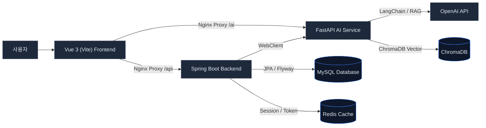

# PLS Jober

> 한 줄 소개: AI 기반 카카오 알림톡 템플릿 생성, 수정 및 정책 검증 서비스

### 시연 영상

| 템플릿 검증 성공 시연 | 템플릿 검증 실패 시연 |
| :---: | :---: |
|  |  |
| [Drive에서 보기](https://drive.google.com/file/d/106-9zGBQi1p282WBMUTikYB9gs4HU7u9/view?usp=sharing) | [Drive에서 보기](https://drive.google.com/file/d/1aeZBEZVs4x4EV_3YdlO25zMt-CZpQzhs/view?usp=sharing) |

---

## 프로젝트 개요

- **기간**: 2025.07 ~ 2025.08
- **인원**: 4명(1 Frontend, 2 Backend, 2 AI)
- **담당 역할**:
  - **Frontend**: 반려 사유 하이라이트 미리보기 UI, 채팅 기반 템플릿 수정 및 세션 관리 구현
  - **Rag/LLM**: RAG, LangChain 기반 LLM을 활용한 카카오 알림톡 템플릿 생성 및 1, 2차 검증 구현

---

## 서비스 구성 및 사용자 플로우

이 프로젝트는 사용자가 필요한 알림 메시지를 작성하는 것부터 AI를 통한 자동 생성, 카카오 심사 가이드 기반 정책 검증, 반려 사유 대응 및 최종 저장에 이르기까지 일련의 **템플릿 라이프사이클**을 유기적으로 제어합니다.

### 알림톡 템플릿 생성 및 검증 플로우

| 단계 | 사용자 동작 (Frontend) | 시스템 처리 (Backend & AI) |
| :---: | :--- | :--- |
| **Step 1** | **알림 목적 및 내용 입력** | 요청을 수신하여 FastAPI AI 서버에 전달 |
| **Step 2** | 생성된 **초안 확인** (본문, 변수, 카테고리) | AI가 템플릿 생성 및 **데이터베이스 1차 저장(Upsert)** |
| **Step 3** | **카카오 알림톡 미리보기** 및 **검증 요청** | `WebClient`를 통해 AI 정책 검증 API 호출 |
| **Step 4** | **반려 사이드바**에서 오류/경고/대안 확인 | 템플릿 본문 규칙 및 광고성 표현 등 분석/검증 결과 반환 |
| **Step 5** | **대체 문구 적용** 및 **채팅 기반 추가 수정** | 세션별 수정 횟수 제한 및 AI 모델 기반 수정본 재생성 |
| **Step 6** | 템플릿 **최종 저장 및 마이페이지 관리** | 사용자 권한(JWT) 검증 및 최종 템플릿 영속화 |

---

## 시스템 아키텍처

## 핵심 기능

### 1. AI 기반 알림톡 템플릿 생성 & 분류
- 사용자의 입력 내용을 분석하여 적절한 본문 메시지, 치환이 필요한 `{{변수}}`, 적절한 카테고리를 추천 및 자동 분류합니다.
- 생성 직후 백엔드에 1차 임시 저장하여 이후 수정/검증 단계의 연속성을 보장합니다.

### 2. 대화형(Chat-based) 템플릿 수정 및 버전 제어
- AI가 도출한 초안에 대해 채팅 형식으로 간편하게 수정 요구사항을 제안할 수 있습니다.
- 세션당 수정 횟수를 제한하여 무분별한 API 호출을 방지하고, 이전 히스토리 버전을 관리하여 취소 및 롤백이 가능합니다.

### 3. 실시간 카카오 알림톡 미리보기
- 카카오 알림톡 실물과 동일한 레이아웃의 프리뷰 컴포넌트를 제공합니다.
- 변수값 표시 토글 기능을 지원하여 실제 고객 발송 시 치환될 레이아웃을 미리 파악할 수 있으며, 오류 영역이 있을 경우 해당 위치를 붉은색으로 하이라이팅하여 즉각 인지하도록 돕습니다.

### 4. 지능형 정책 검증 & 원클릭 대안 적용
- 카카오의 복잡한 심사 가이드를 기반으로 규칙(변수 형식, 광고성 어조, 허용되지 않는 특수문자 등)을 자동 검증합니다.
- 검증 실패 시 반려 사유와 함께 AI가 보정한 대체 문구를 제안하며, 사용자가 반려 사이드바에서 대안을 선택하면 본문에 즉시 반영됩니다.

### 5. 사용자 인증 및 보안 관리
- Spring Security 및 JWT 기반 보안 환경을 제공하며, 카카오 OAuth2 간편 로그인과 일반 회원가입을 모두 지원합니다.
- 자신이 생성한 템플릿에만 접근 및 수정할 수 있도록 리소스 소유 권한을 엄격하게 통제합니다.

---

## 기술 스택 & 선택 이유

| 영역 | 기술 | 대안 스택 대비 선정 이유 (차별점) |
|---|---|---|
| **Frontend** | Vue 3, TypeScript, Vite, Vuetify | • **대안 기각**: **React.js** (상대적으로 무겁고 프레임워크 오버헤드가 큼), **Vanilla JS** (컴포넌트 재사용성 및 생산성 낮음) • **차별점**: 가볍고 빠른 Vue 3 Composition API를 활용해 실시간 템플릿 텍스트 파싱 및 실시간 미리보기 반응성 극대화. |
| **Backend** | Java 17, Spring Boot 3.2, JPA, Flyway | • **대안 기각**: **Node.js Express** (트랜잭션 관리 및 엔터프라이즈 기능 확장 한계), **Python Django** (멀티스레딩 성능 제한) • **차별점**: 견고한 Spring Security 및 JPA 기반의 엄격한 회원/권한 관리와, WebClient 비동기 요청을 통한 대규모 대기 트래픽 처리 역량 확보. |
| **AI Server** | Python, FastAPI, LangChain | • **대안 기각**: **Flask** (비동기 처리(ASGI) 부재로 인한 동시 LLM API 처리 지연), **Spring Boot 내 Python 스크립트 실행** (프로세스 실행 비용 과다) • **차별점**: LangChain 생태계의 풍부한 Python 라이브러리를 네이티브로 활용하면서, FastAPI의 비동기 성능으로 LLM/RAG 호출 대기 시간 최소화. |
| **Database & Cache** | MySQL 8.0, Redis, ChromaDB | • **대안 기각**: **PostgreSQL** (현재 환경에서 단순 구조에 적합한 가볍고 널리 쓰이는 MySQL 선택), **In-Memory Cache** (다중 인스턴스 환경에서 세션 공유 불가) • **차별점**: Flyway를 통한 DB 스키마 형상관리 자동화 및 Redis를 활용한 무중단 분산 세션 관리. ChromaDB를 사용하여 검증 데이터 및 심사 가이드 RAG 고성능 벡터 탐색 지원. |

---

## 기술적으로 어려웠던 점 (Troubleshooting)

### 이슈 1. AI 검증 항목 누적에 따른 응답 지연 및 반려율 개선
- **문제 상황**: AI 검증 항목이 늘어나며 LLM 호출, 벡터 검색, 판단 과정이 순차적으로 누적되어 평균 응답 시간이 10초 이상으로 길어짐. 또한 템플릿 제출 전 사전 검증 없이 그대로 심사 요청하는 구조로 인해 반려율이 높았음.
- **원인 분석**: 변수 개수, 금지어, 형식 오류처럼 규칙이 명확한 항목까지 전부 LLM에 전달하여 불필요한 API 호출이 과다 발생. 유사 템플릿 검색과 위험 표현 분석이 순차 처리되어 대기 시간이 중첩됨. 문서 임베딩이 요청 시마다 새로 수행되어 벡터 탐색 비용이 과도했음.
- **해결 방안**: 기준이 명확한 항목(변수 개수, 금지어, 필수 문구, 형식 오류)은 규칙 기반으로 선처리하고, 해석이 필요한 문구만 LLM에 전달해 불필요한 API 호출을 제거함. 유사 템플릿 검색과 위험 표현 분석은 비동기 병렬 처리로 전환함. 문서 임베딩을 사전에 저장하여 ChromaDB에서 후보군만 조회하도록 구성함. 심사 가이드·블랙리스트·승인·반려 조건을 RAG로 참조하여 제출 전 변수 오류, 금지 표현, 필수 조건 누락을 사전 안내하는 구조를 설계함.
- **결과**: 평균 응답 시간을 10초 이상에서 약 3~4초 수준으로 단축. 내부 테스트 기준 템플릿 승인율을 약 60%에서 85%까지 개선.

### 이슈 2. 생성, 수정, 저장, 검증 단계의 데이터 연결 및 일관성 유실
- **문제 상황**: 템플릿의 생성, 수정, 검증, 최종 저장 단계에 이르는 다단계 플로우에서 `templateId`, 변수 데이터, 카테고리 등의 누락으로 데이터 일관성이 깨짐.
- **원인 분석**: 각 라이프사이클 단계가 완전히 별개의 API로 분리되어 있었고, 비동기 상태 전이 과정에서 상태 동기화 및 클라이언트-서버 간 데이터 홀딩이 명확하지 않았음.
- **해결 방안**: 템플릿 초안 생성 직후 즉시 데이터베이스에 `/api/template/create`를 호출해 1차 저장하고 고유 식별자(`templateId`)를 발급하는 파이프라인으로 개편함. 이후 모든 수정 및 검증 단계는 해당 ID를 영속성 키로 공유하며, 백엔드에 `upsertTemplate` 공통 메서드를 도입해 중복 코드를 줄이고 정합성을 맞춤.
- **결과**: 다단계 상태 전이 과정에서 발생하는 데이터 유실 가능성을 근본적으로 차단하고 코드 복잡도를 30% 감소시킴.

### 이슈 3. AI 정책 검증 결과의 화면 시각화 및 사용자 수정 인터랙션 복잡성
- **문제 상황**: AI가 반환하는 복잡한 중첩 객체 구조의 반려/검증 결과를 프론트 화면에 직관적으로 매칭하여 보여주지 못해 사용자가 수정에 어려움을 겪음.
- **원인 분석**: AI 검증 모델의 반환 규격이 원본 템플릿의 특정 위치 정보(인덱스 등)를 명확히 짚어주지 않아 시각적 매핑이 복잡했음.
- **해결 방안**: 백엔드 레이어에서 검증 결과를 정형화된 `TemplateValidationResponseDto` 구조로 정규화 및 파싱 처리함. 프론트엔드에서는 수신한 DTO를 바탕으로 템플릿 본문 텍스트 내 문제 영역의 매치 포인트를 찾아 실시간으로 인라인 하이라이팅 처리하고, 반려 사이드바에서 문제 원인 및 대체 문구를 원클릭으로 원본 텍스트에 교체 주입할 수 있는 인터랙션 컴포넌트를 설계함.
- **결과**: 반려 사유 인지 시점부터 수정 및 재검증 완료까지 걸리는 사용자 평균 작업 소요 시간을 대폭 절감.

## 결과 및 회고

이 프로젝트를 통해 얻은 가장 큰 기술적 인사이트는, **LLM은 기능(Feature)이 아닌 인프라(Infrastructure)로 다뤄야 한다**는 점입니다. 응답 포맷이 언제든 무너질 수 있다는 전제 아래 파싱·Fallback·UI 피드백까지 방어 설계를 갖추지 않으면, AI 기능이 오히려 전체 서비스의 신뢰성을 갉아먹는 원인이 될 수 있음을 실감했습니다.

또한 관심사 분리(Separation of Concerns)를 아키텍처 수준에서 강제한 것이 유효했습니다. Spring Boot와 FastAPI를 물리적으로 분리하고 WebClient 비동기 호출로 연결함으로써, AI 모델 교체나 프롬프트 변경이 인증·저장 로직에 영향을 주지 않는 구조를 만들었고, 이는 개발 중 실제 반복적인 프롬프트 튜닝 사이클을 빠르게 돌리는 데 직접적인 이점이 되었습니다.

---

## 이후 과제

| 과제 | 방향 |
|---|---|
| **실제 카카오 알림톡 승인율 95% 달성** | 현재 RAG 검색에 사용되는 청크 크기 및 유사도 임계값을 조정하고, 실제 카카오 반려 이력 데이터를 ChromaDB에 추가 적재하여 벡터 탐색 정밀도를 높임. 더불어 프롬프트 내 심사 기준 설명을 Few-shot 예시 형태로 보강하여 경계 케이스 통과율 개선 |
| **UI/UX 개선** | 반려 사이드바를 드래그 가능한 플로팅 패널로 전환하고, 대체 문구 적용 시 본문 diff 미리보기를 제공하여 수정 전·후 변화를 즉각 인지할 수 있도록 개선 |
| **사용자 피드백 기반 프롬프트 강화** | 최종 저장된 템플릿과 사용자가 적용한 대체 문구 선택 이력을 수집·분석하여, 어떤 유형의 표현이 반려되고 어떤 대안이 채택되는지 패턴화. 이를 RAG 문서 및 시스템 프롬프트에 자동 피드백하는 루프를 구성하여 시간이 지날수록 승인율이 스스로 향상되는 자가 개선(Self-improving) 파이프라인 구축 |
